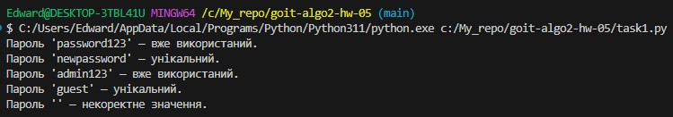
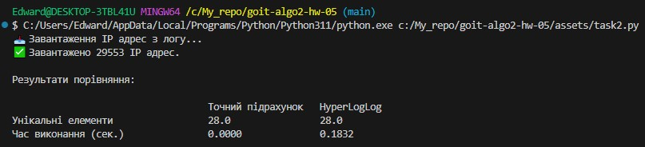

## Завдання 1. Перевірка унікальності паролів за допомогою фільтра Блума

## Завдання 2. Порівняння продуктивності HyperLogLog із точним підрахунком унікальних елементів

При невеликій кількості даних (29 553 IP, з яких лише 28 унікальних), точний підрахунок працює значно швидше, оскільки накладні витрати HyperLogLog стають помітними.

